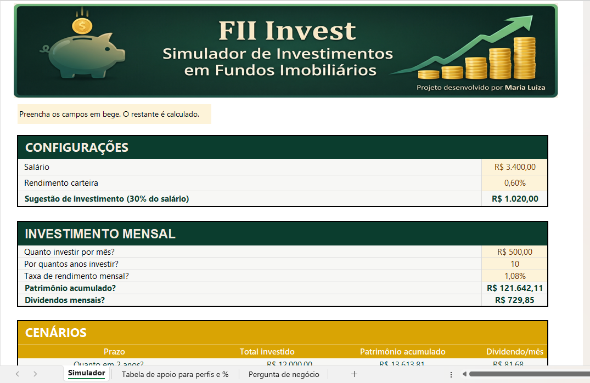
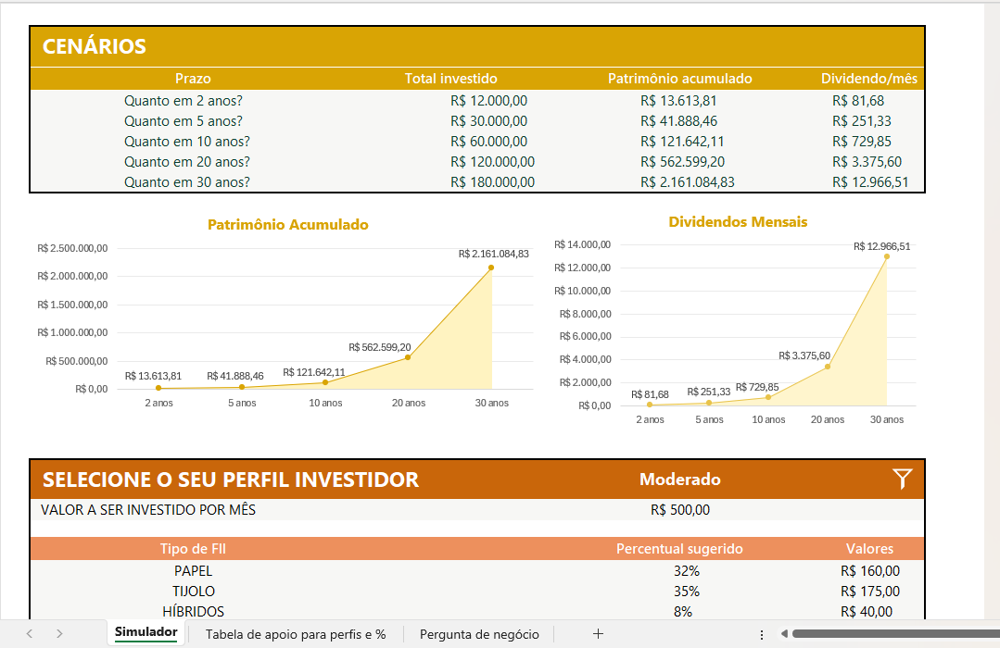
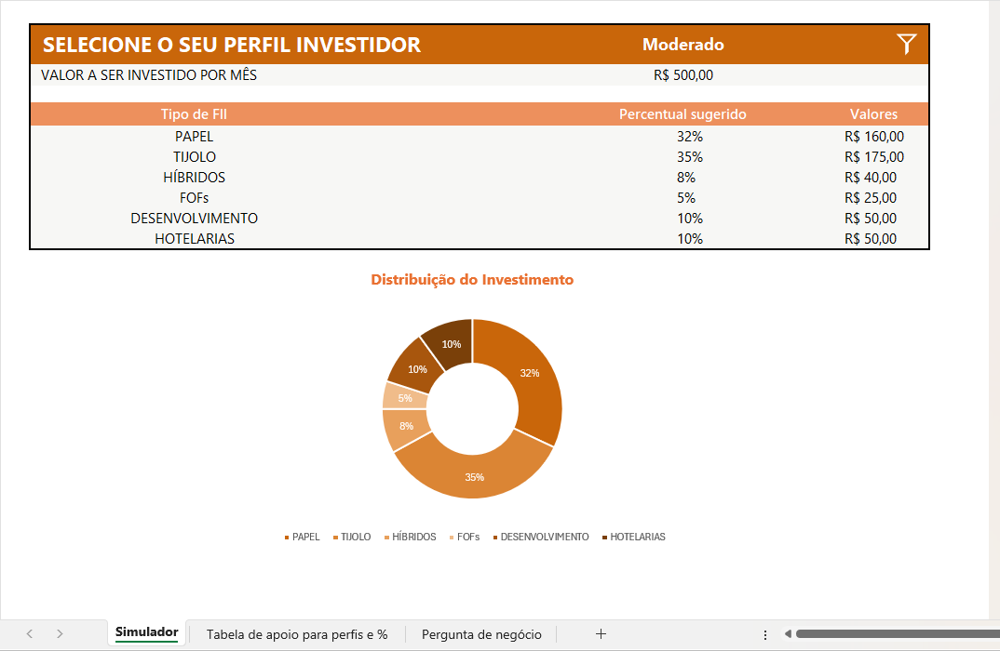
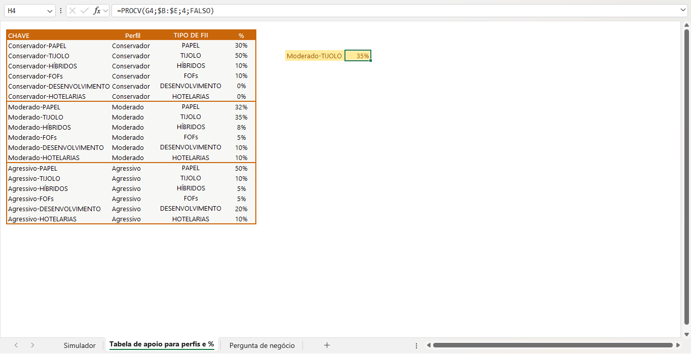

# Simulador de Investimentos em Fundos Imobiliários (FIIs)

Projeto desenvolvido no **Bootcamp Santander de Excel + IA**, com o objetivo de aplicar conceitos de Excel na construção de uma ferramenta prática de simulação de investimentos em Fundos Imobiliários.

---

## Sobre o desafio

A partir da compreensão de como fundos imobiliários funcionam e das perguntas típicas de um investidor (*quanto investir, por quanto tempo, a qual taxa de rendimento*), o desafio consistia em construir uma planilha que automatizasse esses cálculos e apresentasse os resultados de forma clara, ajudando o usuário a tomar decisões mais informadas sobre seus investimentos.

### Objetivos de aprendizagem
* Criar ferramentas de simulação de investimentos em Excel
* Aplicar cálculos financeiros como rendimento mensal e cálculo de dividendos

---

## O que a ferramenta faz

* **Cálculos de Rendimento:** Calcula o patrimônio acumulado e os dividendos mensais com base no valor investido por mês, no prazo e na taxa de rendimento da carteira.
* **Cenários Automáticos:** Apresenta projeções de evolução do investimento em 2, 5, 10, 20 e 30 anos, com total investido, patrimônio acumulado e dividendo mensal em cada período.
* **Alocação por Perfil:** Permite selecionar um perfil de investidor (conservador, moderado, agressivo) e sugere automaticamente a distribuição do aporte mensal entre os diferentes tipos de FII (Papel, Tijolo, Híbridos, FOFs, Desenvolvimento e Hotelaria).
* **Visualização Clara:** Exibe tudo de forma visual, com gráficos de evolução e gráfico de distribuição da carteira.

---

## Recursos e Fórmulas do Excel Aplicados

| Recurso | Onde é usado |
| :--- | :--- |
| **VF (Valor Futuro)** | Cálculo do patrimônio acumulado a partir do aporte mensal e da taxa de rendimento |
| **PROCV** | Busca o percentual de alocação sugerido na tabela de apoio, de acordo com o perfil escolhido |
| **Validação de dados** | Lista suspensa para escolha do perfil investidor, conectada ao PROCV |
| **SOMASE** | Totalização de valores por categoria (ex: total investido por tipo de FII) |
| **CONT.SE** | Contagem condicional de itens por categoria |
| **Referências nomeadas** | Tornam as fórmulas mais legíveis e fáceis de auditar |
| **Formatação condicional** | Destaque visual dos cenários e dos resultados principais |

---

## Sobre a lógica do perfil investidor

Foi criada uma tabela de apoio separada, categorizando cada perfil de investidor (conservador, moderado, agressivo) com seus respectivos percentuais sugeridos por tipo de FII. Na tela principal, a validação de dados oferece a lista de perfis disponíveis, e um `PROCV` busca automaticamente a distribuição correspondente na tabela de apoio — sem necessidade de duplicar fórmulas ou ajustar valores manualmente.

---

## Identidade Visual e Gráficos

A ferramenta segue uma paleta de cores com significado, dividida por categoria de função:

* **🟢 Verde escuro:** Blocos de entrada de dados e cálculo principal (Configurações, Investimento Mensal).
* **🟡 Dourado/Amarelo:** Blocos de visualização temporal (Cenários e gráficos de evolução).
* **🟠 Laranja:** Bloco de definição de perfil e distribuição do investimento.

---

## Como usar

1. Baixe o arquivo de planilha deste repositório.
2. Abra no Microsoft Excel.
3. Preencha os campos destacados em bege (*Salário, Rendimento da carteira, Quanto investir por mês, Por quantos anos*).
4. Selecione seu perfil de investidor na lista suspensa.
5. Veja automaticamente o patrimônio acumulado, os dividendos mensais, os cenários de longo prazo e a sugestão de distribuição da carteira.

---

## Aprendizados

Mais do que aplicar fórmulas financeiras no Excel, este projeto reforçou a importância de comunicar dados com clareza — de nada adianta um cálculo estar correto se o resultado não é fácil de entender à primeira vista. Trabalhar a hierarquia visual (cores, tipografia, organização dos blocos) foi tão parte do desafio quanto a lógica das fórmulas em si.

---

👤 **Autor:** Maria Silva  
🎓 **Projeto:** Bootcamp Santander - Excel + IA (Digital Innovation One - DIO)  

[🔗 Meu LinkedIn](https://www.linkedin.com/in/maria-luiza-leite-silva-/) | [💻 Meu GitHub](https://github.com/mariasilva-sketch)
